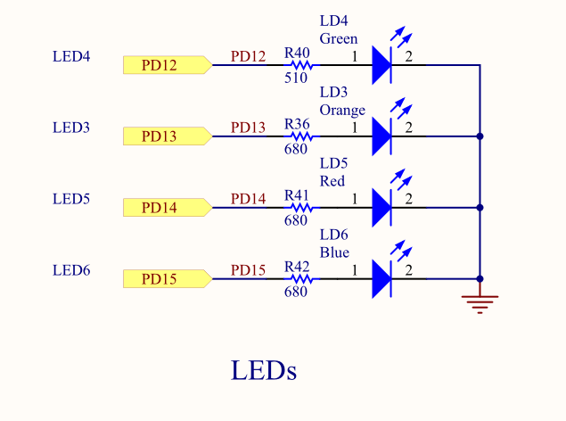
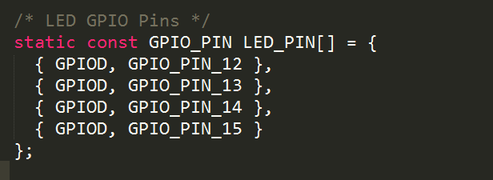

# Quadcopter

## 说明文档

### STcube生成文档

>相对路径地址：Quadcopter/MDK/RTE/Device/STM32F407VGTx/STCubeGenerated/STCubeGenerated.pdf

 [**Github**](https://github.com/yangdonghao/Quadcopter/blob/master/MDK/RTE/Device/STM32F407VGTx/STCubeGenerated/STCubeGenerated.pdf)

- 引脚配置
- 时钟树
- 模块配置
- ...

##版本跟进
###V1:LED灯状态指示
>颜色：绿，橙，红，蓝 

####初始化:
- 红灯亮：MX初始化完成
- 蓝灯亮：MPU初始化完成
- ...
 
###V2:无线串口传输
>发送接收空中延时约为0.2s
