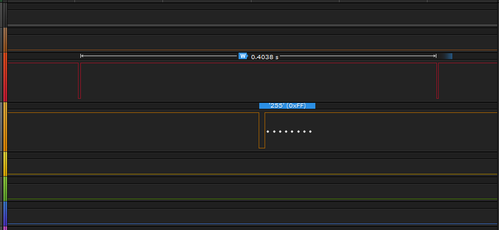
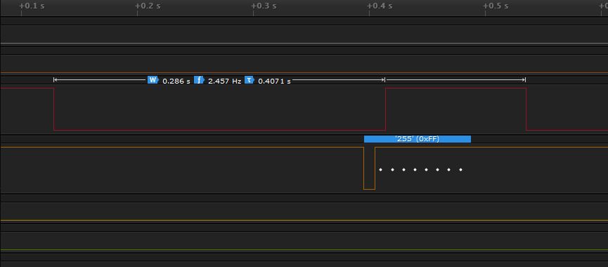
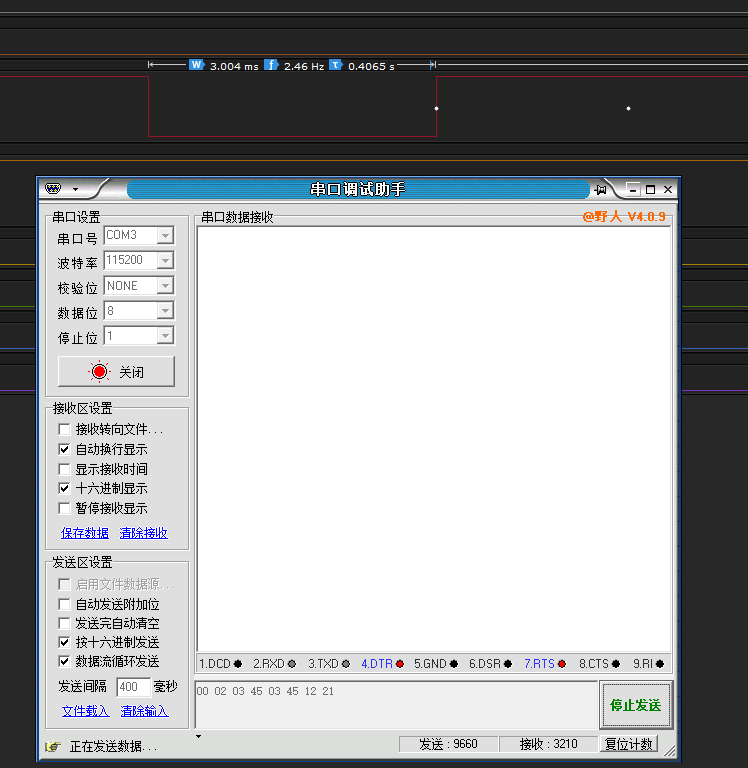
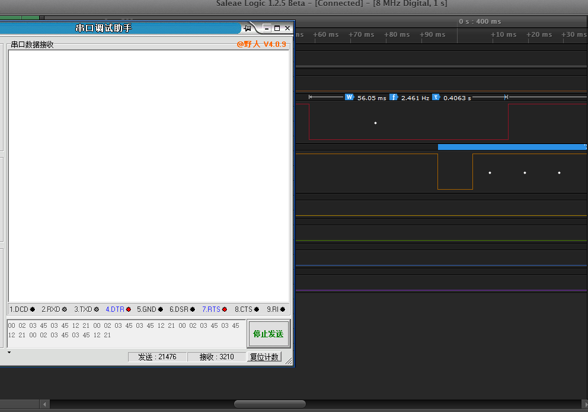
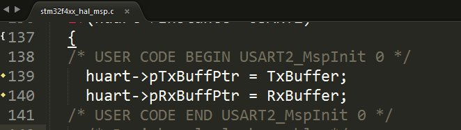
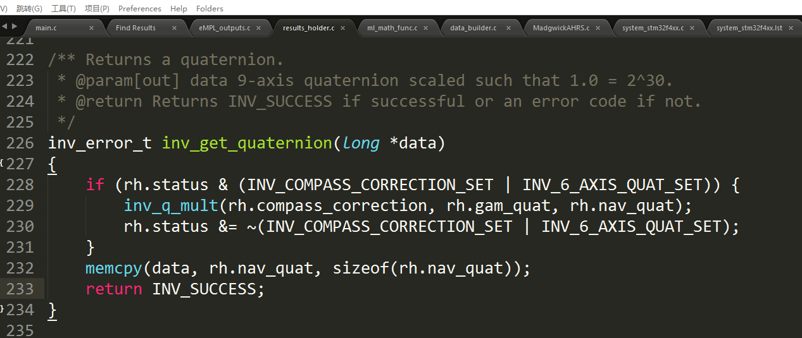
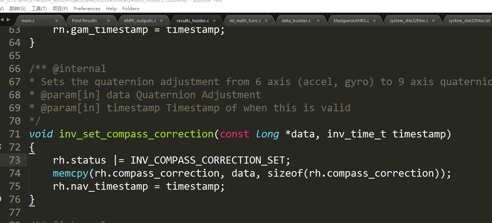

 
**<big>Quadcopter</big>** 

><small>*本文使用Sublime Text 3编辑，使用markdown Preview插件编译生成预览* </small> 

目录

[TOC]

## 说明文档
### STcube生成文档

>相对路径地址：Quadcopter/MDK/RTE/Device/STM32F407VGTx/STCubeGenerated/STCubeGenerated.pdf

 [**Github**](https://github.com/yangdonghao/Quadcopter/blob/master/MDK/RTE/Device/STM32F407VGTx/STCubeGenerated/STCubeGenerated.pdf)

- 引脚配置
- 时钟树
>嘀嗒时钟始终为1000Hz

- 模块配置
- ...

##版本跟进
###V1
####LED灯状态指示

>颜色：

绿|橙|红|蓝
--|--|--|--
0 |1 | 2|3

#####初始化:
- 红灯亮：MX初始化完成
- 蓝灯亮：MPU初始化完成
- ...

###无线串口传输(441M)
>发送接收空中延时约为0.2s

- 8字节传送周期

- 32字节传送周期

- 传输8字节时间

- 传输32字节时间

###串口DMA优化

直接在初始化赋值内存地址，程序运行中自动更新内存地址数据，无需用户操作

###MPU9150
九轴融合重要函数

inv_store_gaming_quaternion

**inv_set_compass_correction**

两个函数为6轴和地磁数据，之后在
inv_get_quaternion
融合

调用关系图（Keil汇编查看）
inv_set_compass_correction(72) <--inv_set_compass_bias_found(358) <--inv_set_compass_bias_error(382) <--inv_set_compass_disturbance(476) <--inv_set_compass_bias(462) <--inv_set_accel_sample_rate(232) <--

